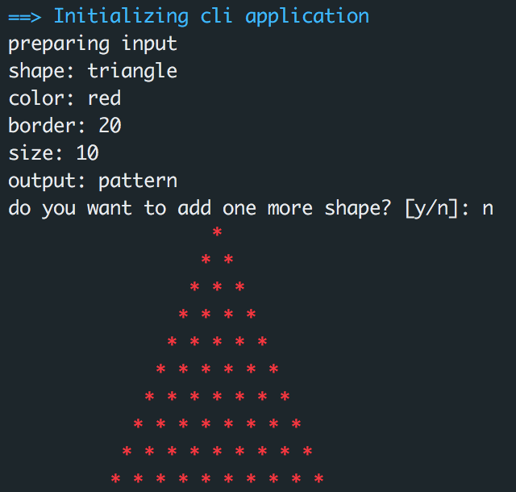

# Graphic Editor APP
===============

Welcome to Graphic Editor application, GE is a CLI application whose purpose is to draft a shape and display it to STDOUT or a downloadable file.

## Table of Contents
* [Requirements](#requirements)
* [Installation](#installation)
* [Usage](#usage)
	* [STDOUT Pattern](#stdout-pattern)
    * [Image (PNG)](#image)
* [Tests](#tests)

## Requirements
To be able to use this application, [Docker](https://www.docker.com/) is required

## Installation
To install the application, clone this repo, cd to the folder, and run **make start**

## Usage
Once the application is installed, go to your terminal, and run the following command: **make shape**.
You will be asked how you want to configure your shape and what kind of output you expect

### STDOUT Pattern
Once asked about what kind of output you want to receive, choose **pattern**

### Image
Once asked about what kind of output you want to receive, choose **image**, this image will be stored in the root of this project

## Tests
If you want to run tests of this application, run the following command: **make test**
